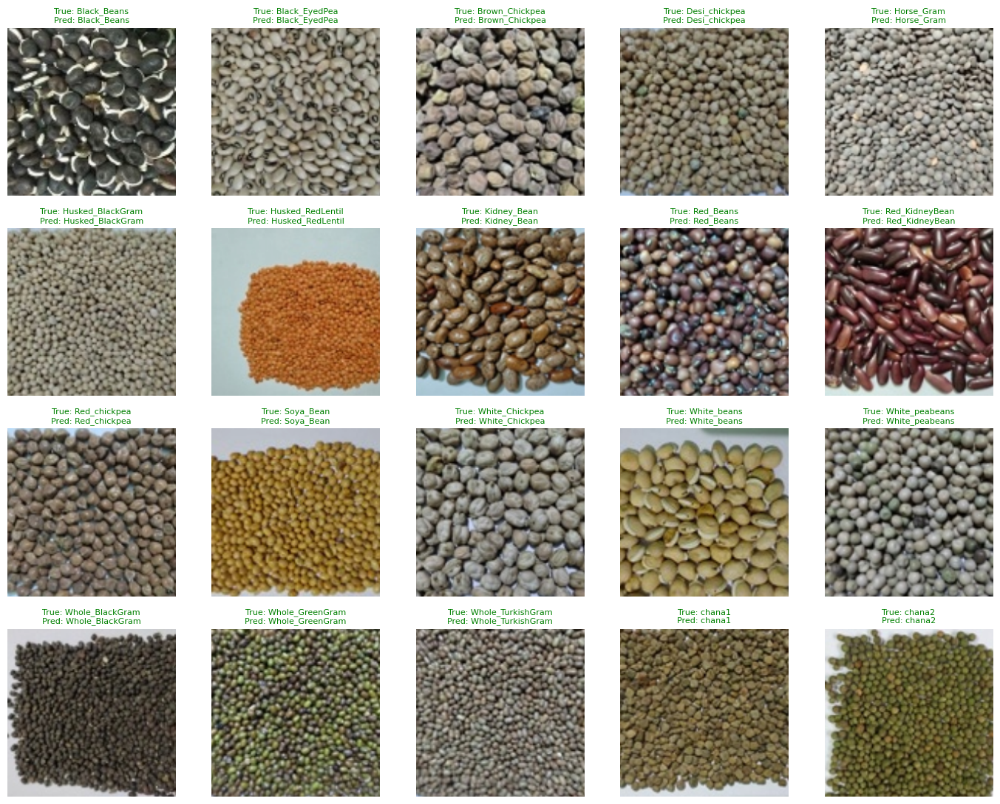
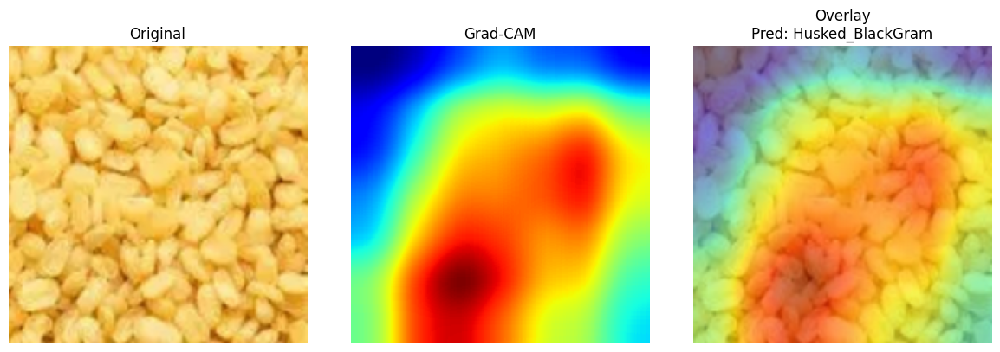

# Indian Lentils Classifier — Transfer Learning & GPU Performance Analysis

A 20-class image classifier for Indian lentils/legumes, built as a vehicle for two
things: a correctly-evaluated transfer-learning baseline, and a GPU performance
investigation (mixed precision, `torch.compile`, and cross-architecture
comparison) benchmarked on an NVIDIA T4.

## Dataset

- **Source:** [Indian Lentils dataset](https://data.mendeley.com/datasets/r4yhfnzc5y/1) (Mendeley Data)
- **Reference paper:** [Automated identification of Indian lentils using deep learning](https://www.sciencedirect.com/science/article/pii/S2666154323004507) — benchmarked 18 CNN architectures (AlexNet, ResNet variants, EfficientNetB0, Inception, VGG, etc.) via a two-phase statistical test (Duncan's multiple range test + Wilcoxon signed-rank test) and concluded **EfficientNetB0** was the strongest performer for this task.
- **20 classes**, 10,000 images (500/class): Black Beans, Kidney Beans, Chickpeas, Chana, Turkish Gram, and other visually similar bean/lentil/gram varieties.
- Split **80/20 (train/eval), stratified** — 8,000 train / 2,000 eval images.

## Methodology notes

An early version of this project evaluated on the same images used for training
(no held-out split), which produced an inflated ~97% accuracy that wasn't a real
measure of generalization. This was corrected by:

- Building two `ImageFolder` instances over the same directory — one with an
  augmenting `train_transform` (`RandomResizedCrop`), one with a deterministic
  `eval_transform` (`Resize` → `CenterCrop`) — since a `Subset`'s transform is
  inherited from its underlying dataset, not overridable per-split.
- Splitting via `sklearn.train_test_split` with `stratify=` on class labels, so
  all 20 classes are proportionally represented in both splits.
- All reported metrics below are on the held-out 2,000-image eval set only.

## Baseline model

Following the cited paper's conclusion, **EfficientNetB0** (ImageNet-pretrained,
`torchvision`) was used as the baseline, fine-tuned end-to-end with its native
224×224 / ImageNet-mean-std preprocessing recipe (confirmed via
`EfficientNet_B0_Weights.DEFAULT.transforms()`).

**Final classification report (held-out eval set, 2,000 images):**

| Metric | Score |
|---|---|
| Overall accuracy | 99.9–100% |
| Macro F1 | 1.00 |

Residual misclassifications (precision/recall of 0.98–0.99 rather than 1.00) were
concentrated among visually similar look-alike classes — e.g. `Kidney_Bean` /
`Red_Beans` / `Red_KidneyBean`, and `Black_Beans` / `Husked_BlackGram` — a
physically sensible error pattern consistent with genuine generalization rather
than a data-leakage artifact.

## Performance analysis (NVIDIA T4, Google Colab)

All experiments below hold the training loop, data, batch size (32), and
resolution (224×224) constant, changing exactly one variable at a time, with
GPU-correct timing (`torch.cuda.synchronize()` bracketing each timed region,
first epoch excluded from steady-state averages to remove one-time
cuDNN/kernel warm-up cost).

### 1. Mixed precision (AMP)

| | Avg epoch time | Speedup | Final eval acc |
|---|---|---|---|
| EfficientNetB0, FP32 | 40.56s | — | 99.90% |
| EfficientNetB0, AMP | 45.76s | **0.89x (slower)** | 95.95% |

**Finding:** AMP did not help. EfficientNetB0's MBConv blocks are dominated by
depthwise separable convolutions, which have low arithmetic intensity (little
compute per byte moved) and are therefore memory-bandwidth-bound rather than
compute-bound. AMP/Tensor Cores accelerate matrix-multiply throughput — but
that was never the bottleneck here, so the extra bookkeeping `autocast`/
`GradScaler` add (dtype casting, loss scaling, inf/NaN checks) came out net
negative.

### 2. `torch.compile`

| | Avg epoch time (steady-state) | Speedup |
|---|---|---|
| EfficientNetB0, eager | 40.56s | — |
| EfficientNetB0, compiled | 56.28s | **0.72x (slower)** |

**Finding:** Also a regression. PyTorch's Inductor backend logged
`Not enough SMs to use max_autotune_gemm mode` — the T4's SM count (40, vs. 108
on an A100) was deemed too small for Inductor's most aggressive kernel-search
mode, so it fell back to more generic Triton-generated kernels. Those apparently
underperformed cuDNN's decades-mature, hand-tuned convolution/batchnorm kernels
for this architecture/GPU combination — `torch.compile`'s fusion benefit didn't
outweigh using less-optimized kernels underneath.

### 3. Architecture comparison: does FLOP count predict GPU latency?

EfficientNetB0 (~0.39 GFLOPs) does roughly 4-5x fewer FLOPs than ResNet18
(~1.8 GFLOPs) — but FLOP count and GPU wall-clock latency are not the same
thing. Hypothesis: ResNet18's dense (non-depthwise) convolutions have much
higher arithmetic intensity and are far better served by both Tensor Cores and
mature cuDNN kernels, so it should run faster *despite* doing more raw compute.

| Model | LR | Avg epoch time | Speedup vs. EfficientNetB0 | Final eval acc |
|---|---|---|---|---|
| EfficientNetB0 (baseline) | 1e-3 | 40.56s | — | 99.90% |
| ResNet18 | 1e-3 | 29.84s | 1.36x | 94.55% (unstable — see below) |
| **ResNet18 (tuned)** | **1e-4** | **26.21s** | **1.55x** | **99.90%** |
| ResNet18 (tuned) + AMP | 1e-4 | 31.93s | 1.27x | 99.90% |

The first ResNet run (`lr=1e-3`) showed large epoch-to-epoch eval accuracy
swings (76% → 97% → 97% → 86% → 99% → 98% → 95%) — a signature of the learning
rate overshooting a minimum during fine-tuning rather than settling into it, not
a hard accuracy ceiling. Lowering the learning rate to `1e-4` (a much cheaper fix
than switching architecture or adding a scheduler) resolved the instability
entirely.

**Result: a properly-tuned ResNet18 matches EfficientNetB0's accuracy exactly
(99.90%) while training 1.55x faster per epoch on this GPU** — despite the cited
paper concluding EfficientNetB0 was the statistically superior architecture for
this task. That conclusion holds for default hyperparameters; it doesn't hold
once the learning rate is tuned per-architecture. Note also that AMP hurt
ResNet18 too (1.27x vs. 1.55x without AMP) — disconfirming the naive
"dense-conv architectures should benefit more from Tensor Cores" hypothesis, and
suggesting the real bottleneck at this batch size (32) on a T4 may be workload
size rather than architecture type (i.e., neither model's per-step compute is
large enough to be genuinely compute-bound on this GPU).

## Key takeaways

- **Fixed a real methodology bug** (leaked/no held-out eval set) that was
  producing a meaningless accuracy number, before trusting any result.
- **Two "negative" performance results (AMP, `torch.compile`), each with a
  specific, GPU-architecture-grounded explanation** — not "it didn't work," but
  *why* it didn't work (memory-bandwidth-bound ops; T4 SM count blocking
  Inductor's autotuning; Triton-generated kernels underperforming mature cuDNN).
- **A genuine improvement over the published baseline**: matched
  state-of-the-art accuracy at 1.55x the training speed, via correct
  per-architecture hyperparameter tuning rather than a new technique.
- All comparisons isolate exactly one variable at a time, with GPU-correct
  timing (`synchronize()`, warm-up exclusion) — the discipline that made the
  negative results trustworthy rather than noise.

## Deployment

The tuned ResNet18 model is deployed as a live, interactive demo:

- **Model:** [silversur4/indian-lentils-image-classifier](https://huggingface.co/silversur4/indian-lentils-image-classifier) — weights + model card on the Hugging Face Hub.
- **Demo:** [Instant-Gram](https://huggingface.co/spaces/silversur4/Instant-Gram) — a Gradio Space; upload a photo or use your camera to classify a lentil/bean/chickpea in real time.

The Space downloads weights from the Model repo at startup rather than bundling
them directly, keeping the app repo itself small.

## Known limitations

Real-world testing against the deployed demo surfaced a meaningful **generalization
gap** that the held-out eval accuracy (99.9%) does not capture: photos taken on a
phone, in ordinary kitchen conditions, are frequently misclassified — e.g. urad
dal consistently predicted as `Husked_RedLentil`, and [moong dal as urad dal](https://silversur4-instant-gram.hf.space/?__theme=system&deep_link=JR0OvSyqDBs).

**Why this happens despite the high eval accuracy:** every image in this dataset —
training *and* eval — comes from the same controlled photo shoot (same lighting,
camera, background, framing). The 80/20 split protects against memorizing
specific images, but it can't protect against the entire dataset sharing one
narrow visual distribution that doesn't match deployment conditions. The model's
suspiciously fast convergence (near-ceiling accuracy within a single epoch, on a
fine-grained 20-way task) is consistent with this in hindsight — a plausible sign
it partly learned shortcuts specific to the studio setup (e.g. subtle
background/lighting/framing cues correlated with class in this one dataset)
rather than purely the lentils' intrinsic visual features, which is a known
failure mode ("shortcut learning") when a dataset's images are more uniform than
the deployment distribution they're meant to represent.

**Not addressed yet, left as a known limitation:** closing this gap would need
either real-world (phone-camera) images mixed into training/eval, or heavier
color/lighting/background augmentation during training to reduce reliance on
studio-specific cues. Neither has been attempted — the held-out eval accuracy
above should be read as "accuracy within this dataset's photography conditions,"
not as a claim of robust real-world performance.

## Hardware

All benchmarks run on a single NVIDIA T4 GPU (Google Colab).

## Stack

PyTorch, torchvision (`EfficientNet_B0_Weights`, `ResNet18_Weights`),
scikit-learn (stratified split, `classification_report`), matplotlib.
